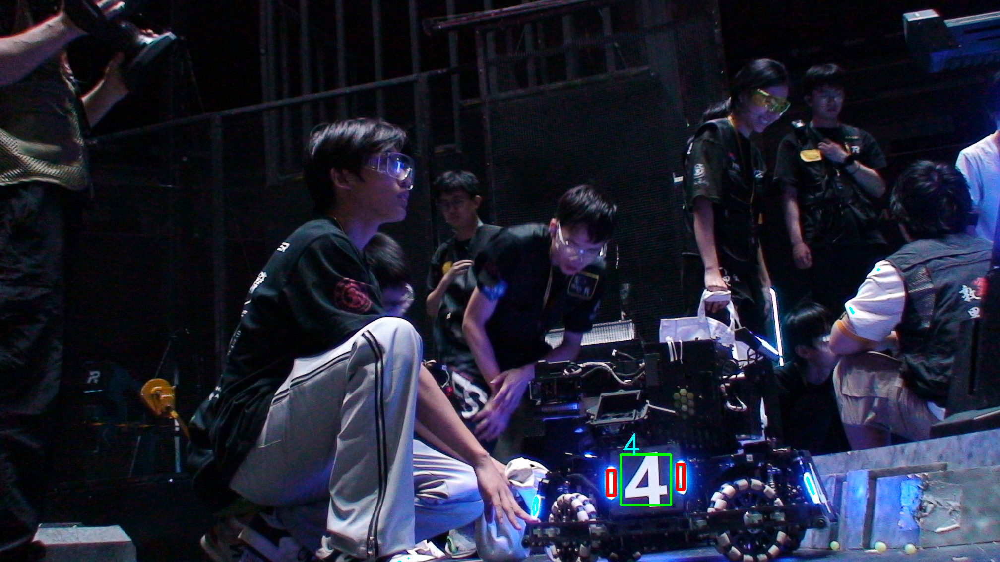
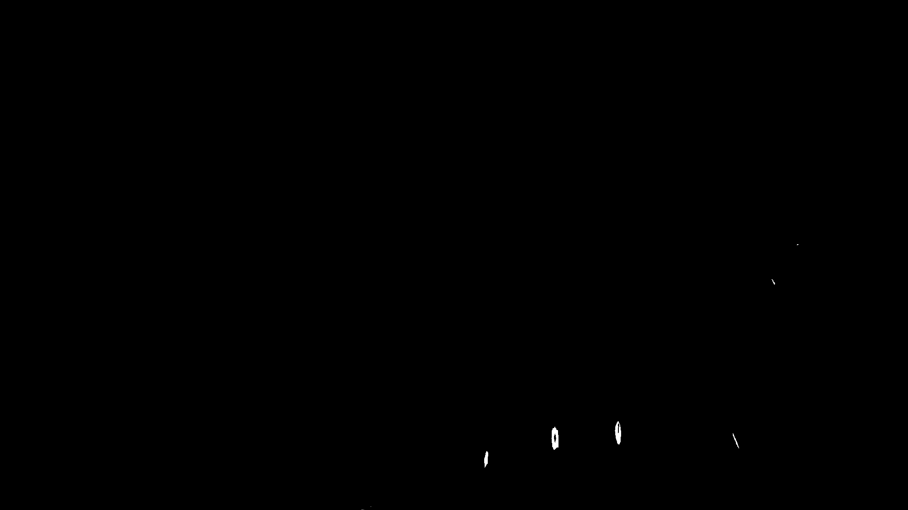

# XJTU_RMV_Task2

[功能概述](#本次完成的功能概况)

[效果展示](#效果展示)

[目录结构](#目录结构)

[代码讲解](#代码讲解)

### 本次完成的功能概况
* **创建TrackBar动态改变HSV，找到最佳HSV**
* **准确定位光条，数字框**
* **使用Tesseract识别装甲板数字**
* **完成所有要求的基础操作**
* **对各种操作进行了反复尝试和比较**
### 效果展示
#### 定位装甲板，识别数字

#### 最优HSV的inRange()处理后的mask图



### 目录结构

``` bash
.
├── bin
│   └── app  #生成文件
├── build #省略了哈
├── build.sh   #属于偷懒的一个构建并执行的脚本
├── CMakeLists copy.txt 
├── CMakeLists.txt
├── compile_commands.json -> build/compile_commands.json
├── img   #这是基本操作的输出文件（不含最终装甲板识别）
│   ├── blur.png  #模糊
│   ├── crop.png  #剪裁1/4
│   ├── gaussblur.png  #高斯模糊
│   ├── gray.png   #灰度图
│   ├── hsv.png   #转为hsv
│   ├── img_contours.png  #去噪效果不是很好的轮廓检测
│   ├── mask.png   #inrange处理后的
│   ├── morph_close.png  #闭运算
│   ├── morph_dilate_gauss.png  #开运算后再膨胀再高斯模糊
│   ├── morph_dilate.png #开运算后膨胀
│   ├── morph_erode.png #开运算后腐蚀
│   ├── morph_gauss.png #开运算后高斯模糊
│   ├── morph_open.png #开运算
│   └── rotate.png #旋转
├── imgfind #这里是再找合适的HSV图的一些图片
│   ├── mask_kernel11.png #高斯模糊的kernel为（11，11）
│   ├── mask_kernel9.png ##高斯模糊的kernel为（9，9）
│   └── mask.png #效果比较好的hsv的inRange
├── imgwork  #这里是找轮廓的最优方法的输出，包括数字检测并识别
│   ├── blur.png  #普通模糊图
│   ├── contours.png   #找到的轮廓图
│   ├── gaussblur.png # 高斯模糊
│   ├── gray.png  #灰度图
│   ├── mask.png  #inRang的输出
│   ├── morph.png  #开运算的输出
│   ├── num.png #找到数字最终画出的图
│   └── rect.png #找到矩形的输出
├── README.md
├── resources
│   └── test_image.png
└── src
    ├── findhsv.cpp  #找合适的hsv
    ├── findhsv.h
    ├── HSVfind.cpp  #最优的找矩形并识别数字的代码
    ├── HSVfind.h
    ├── learn.cpp   #一些试验的demo
    ├── learn.h
    ├── main.cpp   #总控制台
    ├── work.cpp  #所有要求处理图片的代码
    └── work.h
```


### 代码讲解
**简单的给出一些代码部分展示和说明，并不能直接cv运行**
#### TrackBar动态调节HSV

``` cpp
#findhsv.cpp
createTrackbar("Hue Min", "Trackbars", &hmin, 179);
createTrackbar("Hue Max", "Trackbars", &hmax, 179);
createTrackbar("Sat Min", "Trackbars", &smin, 255);
createTrackbar("Sat Max", "Trackbars", &smax, 255);
createTrackbar("Val Min", "Trackbars", &vmin, 255);
createTrackbar("Val Max", "Trackbars", &vmax, 255);

Scalar lower(hmin,smin,vmin);
Scalar upper(hmax,smax,vmax);
inRange(imgHSV, lower, upper, imgMask);
```
#### 图片预处理
``` cpp
int hmin = 62,smin=0,vmin=255;
int hmax =105,smax=59,vmax=255;
Scalar lower(hmin,smin,vmin);
Scalar upper(hmax,smax,vmax);

String img_url = "resources/test_image.png";
Mat img = imread(img_url);
Mat img_origi = imread(img_url);
if(img.empty()){
    cout<<"img not fount,你把帅气的l管藏哪里了"<<endl;
    return -1;
}
Mat img_gray,img_hsv,img_mask,img_morph;
cvtColor(img, img_gray, COLOR_BGR2GRAY);
imwrite("imgwork/gray.png", img_gray);
Mat img_blur,img_gaussblur;
blur(img, img_blur, Size(3,3));
GaussianBlur(img, img_gaussblur, Size(13,13), 7);
imwrite("imgwork/blur.png", img_blur);
imwrite("imgwork/gaussblur.png", img_gaussblur);
cvtColor(img_gaussblur, img_hsv, COLOR_BGR2HSV);
inRange(img_hsv, lower, upper, img_mask);
imwrite("imgwork/mask.png", img_mask);
Mat kernel = getStructuringElement(MORPH_RECT, Size(7,7));
morphologyEx(img_mask, img_morph, MORPH_CLOSE, kernel);
imwrite("imgwork/morph.png", img_morph);


vector<vector<Point>> contours;
vector<Vec4i> hierarchy;
vector<Rect> rects;
findContours(img_morph,contours,hierarchy,RETR_EXTERNAL,CHAIN_APPROX_SIMPLE);

```
#### 定位数字矩形
对于数字定位，这里采用根据光条定位。  
我们找出两个光条之后，直接找到两个光条的中心，把这两个中心的中点作为我们num_rec的中心，而这个矩阵的边长直接等于光条的边长的2倍。  
为什么这么设置？光条实物看起来好像满足这个关系。
``` cpp
Rect desrec;
if (rects.size() == 2) {
    Rect rect1 = rects[0];
    Rect rect2 = rects[1];
    Point center1(rect1.x + rect1.width / 2, rect1.y + rect1.height / 2);
    Point center2(rect2.x + rect2.width / 2, rect2.y + rect2.height / 2);
    Point newCenter((center1.x + center2.x) / 2, (center1.y + center2.y) / 2);
    
    int longSide1 = max(rect1.width, rect1.height);
    int longSide2 = max(rect2.width, rect2.height);
    int newSide = 2 * max(longSide1, longSide2);
    
    int newX = newCenter.x - newSide / 2;
    int newY = newCenter.y - newSide / 2;
    
    Rect newRect(newX, newY, newSide, newSide);
    desrec = newRect;
    rectangle(img, newRect, Scalar(0, 255, 0), 3);
}
```
#### 数字识别
这里使用Tesseract来进行数字识别，不为别的，只是因为，这个是光学库，体积小，使用简单，而且相比于yolo，使用的资源可以说非常小了。  
如此轻量级，那必须用了。  
数字被识别出来后会被画在矩形的左上角。  
因为只涉及到识别一个数字，所以是先识别到装甲板，然后根据装甲板图片识别数字。  
有因为只有一个数字，所以本代码很简单，代码不具备健壮性（没有做关于多数字的考虑）
``` cpp
// Tesseract OCR库 轻量级识别数字
char findnum(Mat imgnum){
    if(imgnum.empty()){
        cout<<"找不到我们帅气的l管哥哥了，img错误"<<endl;
        return -1;
    }
    Mat img_gray,img_bin;
    cvtColor(imgnum,img_gray, COLOR_BGR2GRAY);
    threshold(img_gray, img_bin,0,255, THRESH_BINARY_INV | THRESH_OTSU);//反向二值化
    imshow("imgnum",img_bin);
    tesseract::TessBaseAPI tess;
    // 仅识别数字（设置白名单：0-9）
    tess.SetVariable("tessedit_char_whitelist", "0123456789");
    // 初始化OCR引擎（参数为训练数据路径，""表示使用默认路径）
    if (tess.Init("", "osd")) {
        cerr << "无法初始化tesseract OCR引擎！" << endl;
        return -1;
    }
    tess.SetImage(img_bin.data, img_bin.cols, img_bin.rows, 1, img_bin.cols);
    char* outText = tess.GetUTF8Text();
    string text(outText);
    delete[] outText;
    ///int result =  text[0]-'0';
    char result = text[0];
    return result;
}
```